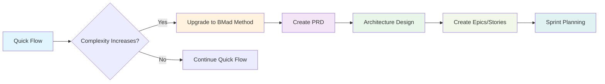

# Integration with Other Workflows

## Upgrading Tracks

If a Quick Flow feature grows in complexity:



## Using Party Mode

For complex Quick Flow challenges:

```bash
# Start Barry
/bmad:bmm:agents:quick-flow-solo-dev

# Begin party mode for collaborative problem-solving
party-mode
```

Party mode brings in relevant experts:

- **Architect** - For design decisions
- **Dev** - For implementation pairing
- **QA** - For test strategy
- **UX Designer** - For user experience
- **Analyst** - For requirements clarity

## Quality Assurance Integration

Quick Flow can integrate with TEA agent for automated testing:

- Test case generation
- Automated test execution
- Coverage analysis
- Test healing

---
