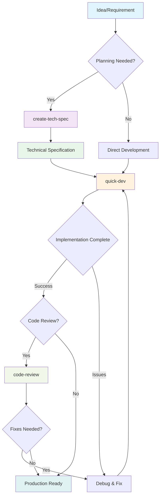

# The Quick Flow Process



## Step 1: Optional Technical Specification

The `create-tech-spec` workflow transforms requirements into implementation-ready specifications.

**Key Features:**

- Conversational spec engineering
- Automatic codebase pattern detection
- Context gathering from existing code
- Implementation-ready task breakdown
- Acceptance criteria definition

**Process Flow:**

1. **Problem Understanding**
   - Greet user and gather requirements
   - Ask clarifying questions about scope and constraints
   - Check for existing project context

2. **Code Investigation (Brownfield)**
   - Analyze existing codebase patterns
   - Document tech stack and conventions
   - Identify files to modify and dependencies

3. **Specification Generation**
   - Create structured tech specification
   - Define clear tasks and acceptance criteria
   - Document technical decisions
   - Include development context

4. **Review and Finalize**
   - Present spec for validation
   - Make adjustments as needed
   - Save to sprint artifacts

**Output:** `{sprint_artifacts}/tech-spec-{slug}.md`

## Step 2: Development

The `quick-dev` workflow executes implementation with flexibility and speed.

**Two Execution Modes:**

**Mode A: Tech-Spec Driven**

```bash
# Execute from tech spec
quick-dev tech-spec-feature-x.md
```

- Loads and parses technical specification
- Extracts tasks, context, and acceptance criteria
- Executes all tasks in sequence
- Updates spec status on completion

**Mode B: Direct Instructions**

```bash
# Direct development commands
quick-dev "Add password reset to auth service"
quick-dev "Fix the memory leak in image processing"
```

- Accepts direct development instructions
- Offers optional planning step
- Executes immediately with minimal friction

**Development Process:**

1. **Context Loading**
   - Load project context if available
   - Understand patterns and conventions
   - Identify relevant files and dependencies

2. **Implementation Loop**
   For each task:
   - Load relevant files and context
   - Implement following established patterns
   - Write appropriate tests
   - Run and verify tests pass
   - Mark task complete and continue

3. **Continuous Execution**
   - Works through all tasks without stopping
   - Handles failures by requesting guidance
   - Ensures tests pass before continuing

4. **Verification**
   - Confirms all tasks complete
   - Validates acceptance criteria
   - Updates tech spec status if used

## Step 3: Optional Code Review

The `code-review` workflow provides senior developer review of implemented code.

**When to Use:**

- Production-critical features
- Security-sensitive implementations
- Performance optimizations
- Team development scenarios
- Learning and knowledge transfer

**Review Process:**

1. Load story context and acceptance criteria
2. Analyze code implementation
3. Check against project patterns
4. Validate test coverage
5. Provide structured review notes
6. Suggest improvements if needed

---
