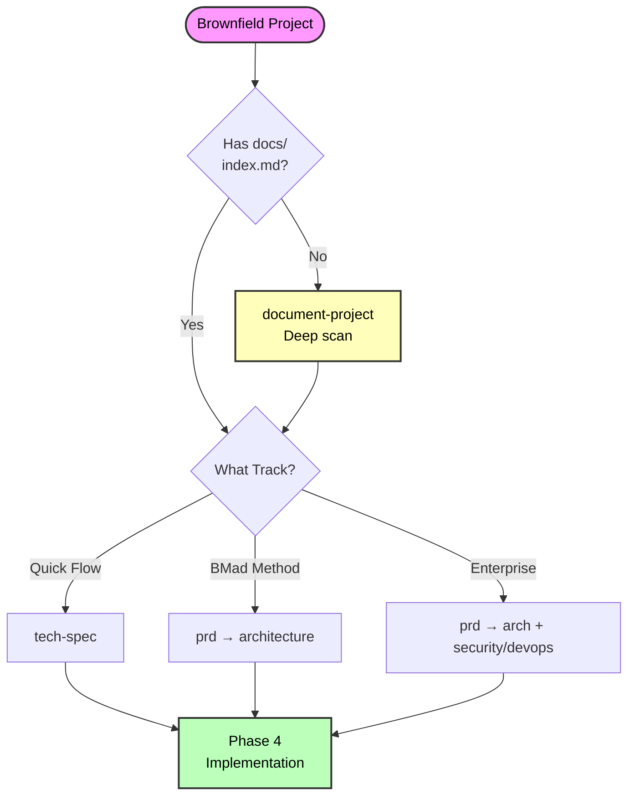

# Quick Reference

## Commands by Phase

```bash
# Documentation (If Needed)
# Analyst agent:
document-project        # Create comprehensive docs (10-30min)
# OR load index-docs task for existing docs (2-5min)

# Phase 1: Analysis (Optional)
# Analyst agent:
brainstorm-project      # Explore solutions
research                # Gather data
product-brief           # Strategic planning (BMad Method/Enterprise only)

# Phase 2: Planning (Required)
# PM agent:
tech-spec               # Quick Flow track
prd                     # BMad Method/Enterprise tracks

# Phase 3: Solutioning (BMad Method/Enterprise)
# Architect agent:
create-architecture          # Create/extend architecture
create-epics-and-stories     # Create epics and stories (after architecture)
implementation-readiness     # Final validation

# Phase 4: Implementation (All Tracks)
# SM agent:
sprint-planning              # Initialize tracking
create-story                 # Create story

# DEV agent:
dev-story                    # Implement
code-review                  # Review

# SM agent:
retrospective                # After epic
correct-course               # If issues
```

## Key Files

**Documentation Output:**

- `docs/index.md` - **Master AI entry point (REQUIRED)**
- `docs/project-overview.md`
- `docs/architecture.md`
- `docs/source-tree-analysis.md`

**Phase 1-4 Tracking:**

- `docs/bmm-workflow-status.yaml` - Progress tracker

**Phase 2 Planning:**

- `docs/tech-spec.md` (Quick Flow track)
- `docs/PRD.md` (BMad Method/Enterprise tracks - FRs/NFRs only)

**Phase 3 Solutioning:**

- Epic breakdown (created after architecture)

**Phase 3 Architecture:**

- `docs/architecture.md` (BMad Method/Enterprise tracks)
- `docs/epics.md` + epic folders (from create-epics-and-stories)

**Phase 4 Implementation:**

- `docs/sprint-status.yaml` - **Single source of truth**
- `docs/epic-{n}-context.md`
- `docs/stories/{epic}-{story}-{title}.md`
- `docs/stories/{epic}-{story}-{title}-context.md`

## Decision Flowchart



---
