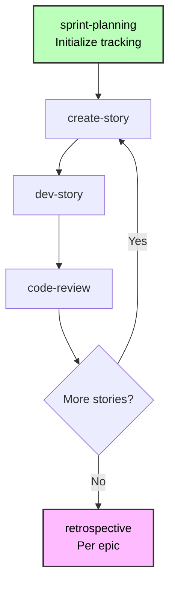

# Workflow Phases by Track

## Phase 1: Analysis (Optional)

**Workflows:**

- `brainstorm-project` - Solution exploration
- `research` - Technical/market research
- `product-brief` - Strategic planning (BMad Method/Enterprise tracks only)

**When to use:** Complex features, technical decisions, strategic additions

**When to skip:** Bug fixes, well-understood features, time-sensitive changes

See the [Workflows section in BMM README](../README.md) for details.

## Phase 2: Planning (Required)

**Planning approach adapts by track:**

**Quick Flow:** Use `tech-spec` workflow

- Creates tech-spec.md
- Auto-detects existing stack (brownfield)
- Confirms conventions with you
- Generates implementation-ready stories

**BMad Method/Enterprise:** Use `prd` workflow

- Creates PRD.md with FRs/NFRs only
- References existing architecture
- Plans integration points
- Epics+Stories created AFTER architecture phase

**Brownfield-specific:** See [Scale Adaptive System](./scale-adaptive-system.md) for complete workflow paths by track.

## Phase 3: Solutioning (BMad Method/Enterprise Only)

**Critical for brownfield:**

- Review existing architecture FIRST
- Document integration points explicitly
- Plan backward compatibility
- Consider migration strategy

**Workflows:**

- `create-architecture` - Extend architecture docs (BMad Method/Enterprise)
- `create-epics-and-stories` - Create epics and stories AFTER architecture
- `implementation-readiness` - Validate before implementation (BMad Method/Enterprise)

## Phase 4: Implementation (All Tracks)

**Sprint-based development through story iteration:**

**Status Progression:**

- Epic: `backlog → in-progress → done`
- Story: `backlog → ready-for-dev → in-progress → review → done`

**Brownfield-Specific Implementation Tips:**

1. **Respect existing patterns** - Follow established conventions
2. **Test integration thoroughly** - Validate interactions with existing code
3. **Use feature flags** - Enable gradual rollout

---
