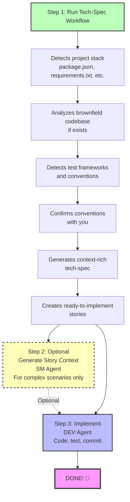

# Quick Spec Flow Overview

```mermaid
flowchart TD
    START[Step 1: Run Tech-Spec Workflow]
    DETECT[Detects project stack<br/>package.json, requirements.txt, etc.]
    ANALYZE[Analyzes brownfield codebase<br/>if exists]
    TEST[Detects test frameworks<br/>and conventions]
    CONFIRM[Confirms conventions<br/>with you]
    GENERATE[Generates context-rich<br/>tech-spec]
    STORIES[Creates ready-to-implement<br/>stories]

    OPTIONAL[Step 2: Optional<br/>Generate Story Context<br/>SM Agent<br/>For complex scenarios only]

    IMPL[Step 3: Implement<br/>DEV Agent<br/>Code, test, commit]

    DONE[DONE! 🚀]

    START --> DETECT
    DETECT --> ANALYZE
    ANALYZE --> TEST
    TEST --> CONFIRM
    CONFIRM --> GENERATE
    GENERATE --> STORIES
    STORIES --> OPTIONAL
    OPTIONAL -.->|Optional| IMPL
    STORIES --> IMPL
    IMPL --> DONE

    style START fill:#bfb,stroke:#333,stroke-width:2px
    style OPTIONAL fill:#ffb,stroke:#333,stroke-width:2px,stroke-dasharray: 5 5
    style IMPL fill:#bbf,stroke:#333,stroke-width:2px
    style DONE fill:#f9f,stroke:#333,stroke-width:3px
```

---
