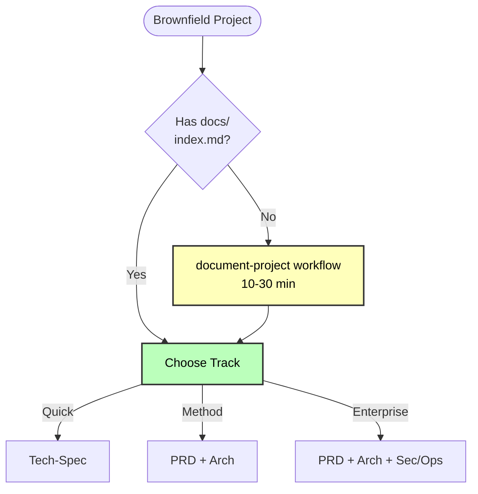

# Brownfield Projects

## Critical First Step

For ALL brownfield projects: Run `document-project` BEFORE planning workflows.

## Why document-project is Critical

**Quick Flow** uses it for:

- Auto-detecting existing patterns
- Understanding codebase structure
- Confirming conventions

**BMad Method** uses it for:

- Architecture inputs (existing structure)
- Integration design
- Pattern consistency

**Enterprise Method** uses it for:

- Security analysis
- Integration architecture
- Risk assessment

## Brownfield Workflow Pattern

---
