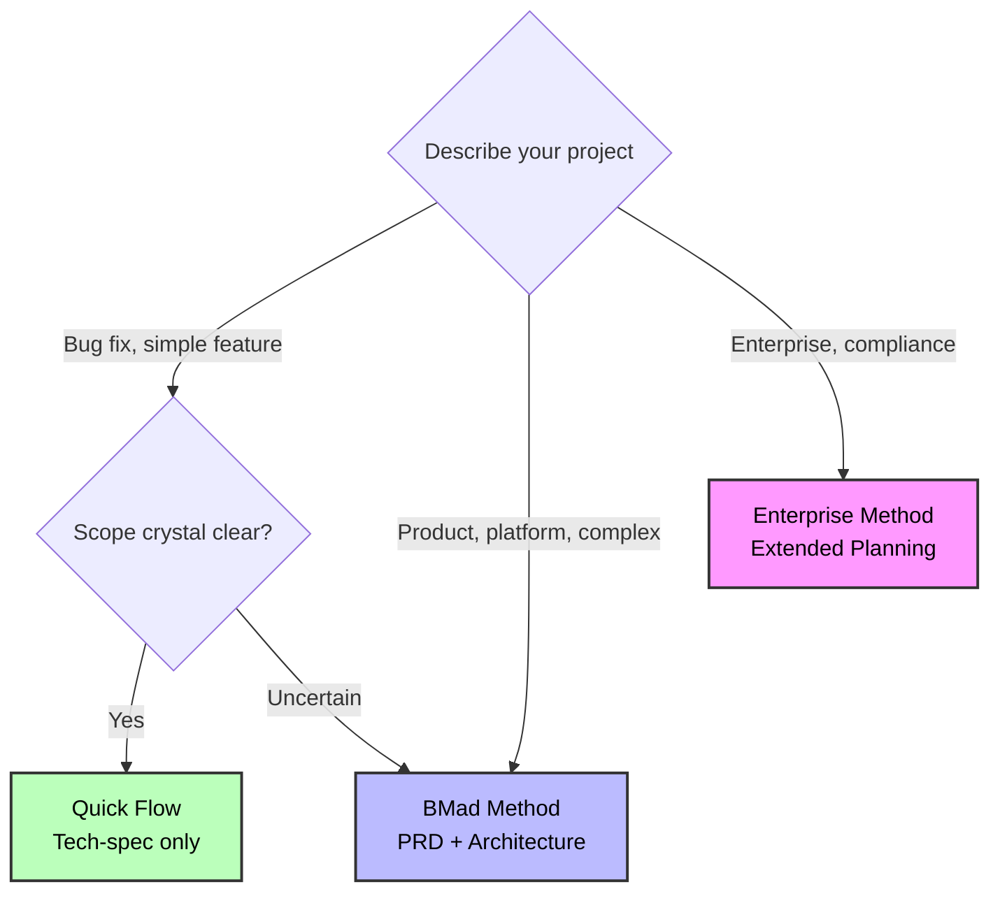

# Quick Reference

## Three Tracks at a Glance

| Track                 | Planning Depth        | Best For                                   |
| --------------------- | --------------------- | ------------------------------------------ |
| **Quick Flow**        | Tech-spec only        | Simple features, bug fixes, clear scope    |
| **BMad Method**       | PRD + Arch + UX       | Products, platforms, complex features      |
| **Enterprise Method** | Method + Test/Sec/Ops | Enterprise needs, compliance, multi-tenant |

## Decision Tree

## Quick Keywords

- **Quick Flow**: fix, bug, simple, add, clear scope
- **BMad Method**: product, platform, dashboard, complex, multiple features
- **Enterprise Method**: enterprise, multi-tenant, compliance, security, audit

---
