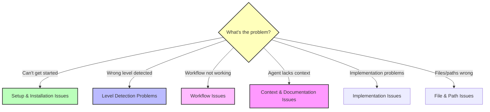

# Quick Diagnosis

**Use this flowchart to find your issue:**

```mermaid
flowchart TD
    START{What's the problem?}

    START -->|Can't get started| SETUP[Setup & Installation Issues]
    START -->|Wrong level detected| LEVEL[Level Detection Problems]
    START -->|Workflow not working| WORKFLOW[Workflow Issues]
    START -->|Agent lacks context| CONTEXT[Context & Documentation Issues]
    START -->|Implementation problems| IMPL[Implementation Issues]
    START -->|Files/paths wrong| FILES[File & Path Issues]

    style START fill:#ffb,stroke:#333,stroke-width:2px
    style SETUP fill:#bfb,stroke:#333,stroke-width:2px
    style LEVEL fill:#bbf,stroke:#333,stroke-width:2px
    style WORKFLOW fill:#fbf,stroke:#333,stroke-width:2px
    style CONTEXT fill:#f9f,stroke:#333,stroke-width:2px
```

---
